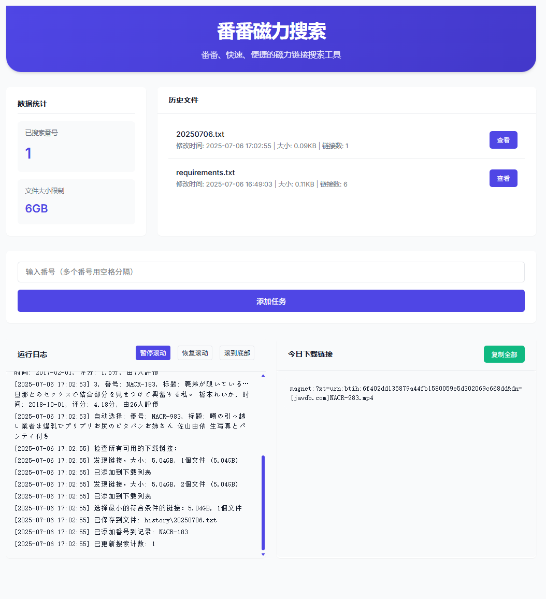

# 基于Crawl4AI 制作的，简单番番筛选链接。

一个基于 Flask 的网页应用程序，用于番番搜索磁力链接。它提供了一个简单的用户界面，支持批量搜索和链接管理。



## 功能特点

- 🔍 支持批量搜索番号
- 💾 自动保存搜索结果
- 🔄 实时显示搜索进度
- 📊 显示文件大小和评分信息
- 🎯 智能选择最佳下载链接
- 📁 自动整理和管理下载历史
- ⚙️ 可配置的文件大小限制
- 🔒 避免重复搜索相同番号

## 功能痛点

- 🚫 无法直接下载，需要手动复制链接到其他工具中（xunlei）
- 🔁 无法直接刮削，需要配合(https://github.com/sqzw-x/mdcx) 这个大佬的工具,

待继续用优化

## 安装说明

1. 克隆仓库：

```bash

cd crawl4ai-AV
```

2. 安装依赖：

```bash
pip install -r requirements.txt
```

## 使用方法

1. 启动服务器：

```bash
python web.py
```

2. 打开浏览器访问：

- 本地访问：http://localhost:5000
- 局域网访问：http://你的IP:5000

3. 在搜索框中输入番号（支持多个番号，用空格分隔）
4. 点击"添加任务"按钮开始搜索

## 配置说明

- 文件大小限制：默认为 6GB，可以在网页界面中修改
- 搜索结果保存在 `history` 目录下，按日期命名
- 配置文件：`settings.json`
- 搜索记录：`searched_count.json`

## 目录结构

```
crawl4ai/
├── web.py              # 主程序
├── requirements.txt    # 依赖列表
├── settings.json       # 配置文件
├── history/           # 历史记录目录
└── templates/         # 网页模板
    └── template.html  # 主页面模板
```

## 技术栈

- Python 3.6+
- Flask
- BeautifulSoup4
- AsyncIO
- JavaScript/HTML/CSS

## 注意事项

1. 请确保你的网络环境能够正常访问目标网站
2. 建议使用代理服务器以提高访问稳定性
3. 程序会自动过滤重复的搜索请求
4. 默认使用异步处理以提高性能

## 更新日志

### v0.6.3

- 修复了多线程搜索的问题
- 优化了启动信息显示
- 改进了文件保存逻辑
- 添加了搜索进度显示

### v0.6.2

- 添加了文件大小限制功能
- 优化了链接保存逻辑
- 改进了错误处理

## 贡献指南

欢迎提交 Issue 和 Pull Request 来帮助改进这个项目。

## 许可证

MIT License
